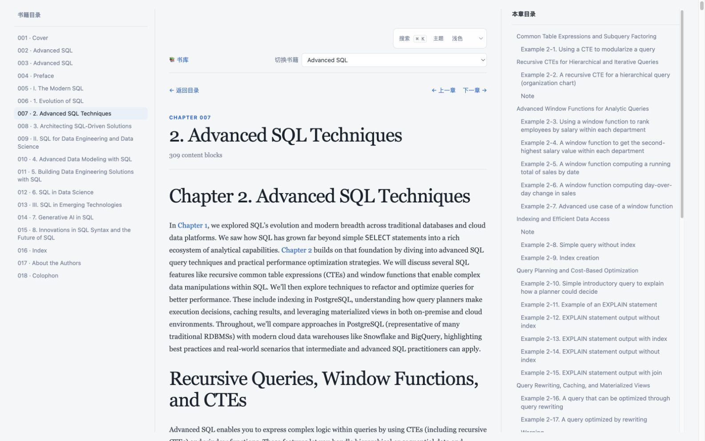
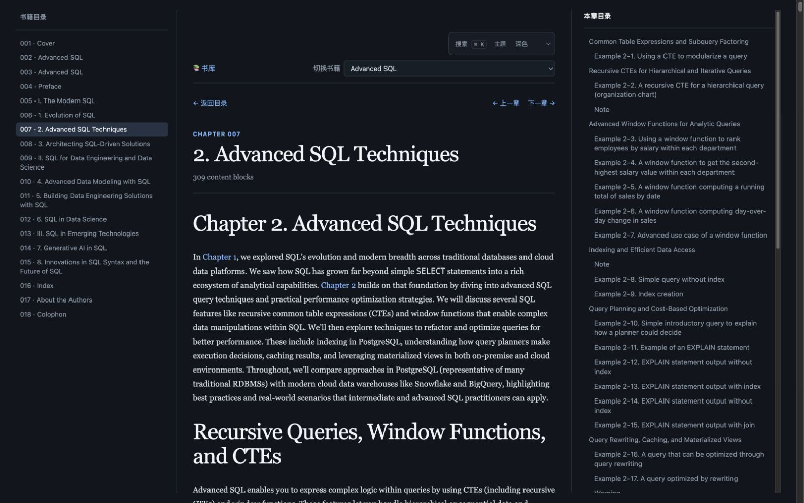

# BookWeave

[](https://github.com/snakepy512/BookWeave/actions/workflows/ci.yml)
[](LICENSE)

[English](README.md) | [简体中文](README.zh-CN.md)

BookWeave 是一个 EPUB-first 的电子书阅读和文档转换工具链。它将 EPUB 内容转换为适合浏览器阅读和翻译的逐章 HTML 页面，同时保留 PDF 作为视觉核对和稳定的页级证据。

项目仍然通过兼容命令支持仅使用 PDF 的输入。

## 阅读器预览

面向 macOS 桌面阅读的章节页将书籍目录、正文和本章目录分为三栏；搜索与主题控件位于切换书籍控件的上方。

### 浅色主题



### 深色主题



## 快速开始

BookWeave 使用 Python 3.14，并通过 [uv](https://docs.astral.sh/uv/) 管理依赖：

```bash
uv sync
uv run python book-reader-builder.py --source-dir . -o ./book-web --server
```

本地服务器地址为 `http://127.0.0.1:8080/index.html`。如果不启动服务器，也可以直接打开生成的 `book-web/index.html`。

BookWeave 是以脚本为入口的本地工具，不需要安装成 Python package。推荐使用 `uv run` 执行命令，以确保使用锁定的依赖版本。

如需用一条命令长期在本机运行静态阅读站点，请参阅 [本地部署说明](local-deployment/README.md)。

## 输入源

项目采用 EPUB-first 的源文件布局：

```text
source-epub/   # 可重排正文的首选来源
source-pdf/    # 视觉核对和稳定的页级证据
```

这两个目录中的实际 EPUB/PDF 文件已被 Git 忽略，不应提交。仓库只保留空目录占位文件；使用者需要自行准备有权处理的书籍文件。

当匹配的 EPUB 和 PDF 同时存在时，EPUB 提供正文阅读层，生成结果会保留两个原始文件。仅有 EPUB 或仅有 PDF 时也可以独立运行。

## 使用

### EPUB 浏览器阅读器

省略输入文件时，BookWeave 会扫描 `source-epub/` 和 `source-pdf/`：

```bash
uv run python book-reader-builder.py --source-dir . -o ./book-web
uv run python book-reader-builder.py --source-dir . -o ./book-web --server
uv run python book-reader-builder.py --source-dir . -o ./book-web --layout both
uv run python book-reader-builder.py --source-dir . -o ./book-web --chapter 3
```

如果 EPUB 和 PDF 同时存在，正文来自 EPUB。原始 EPUB 会解压到 `epub-source/`，用于加载图片等本地资源；PDF 会作为视觉核对文件保留。

扫描 `source-epub/` 或 `source-pdf/` 时，同一条命令始终会生成一个静态书库：`book-web/index.html` 展示所有发现的书籍（包括只有一本书的情况），每本书位于 `book-web/books/<book-id>/` 下。生成的 EPUB/PDF 页面都提供返回书库和切换书籍入口。使用 `--book NAME` 则只构建指定书籍。

EPUB 和 PDF 会按规范化后的文件名 stem 配对，例如 `source-epub/design.epub` 与 `source-pdf/design.pdf` 会被视为同一本书。生成的 `library.json` 保存书库目录信息，不包含本地绝对源文件路径。

阅读器支持 `--style dark|light|sepia`。默认生成 `index.html`，以及 `chapters/` 下每章一个 HTML 文件，便于翻译工具逐章处理。使用 `--layout merged` 可以生成兼容用的单页版本，使用 `--layout both` 可以同时生成两种布局。

生成的 `book-web/` 和 `output/` 目录可以随时重新生成，不应提交到版本控制。

### PDF 兼容阅读器

生成单页文件：

```bash
uv run python pdf-reader-builder.py book.pdf
```

将生成 `page_0001.html`、`page_0002.html` 等文件。

生成合并文件：

```bash
uv run python pdf-reader-builder.py book.pdf --merge
```

启动本地服务器：

```bash
uv run python pdf-reader-builder.py book.pdf --merge --server
```

选择主题：

```bash
uv run python pdf-reader-builder.py book.pdf -o ./reading --style light
```

可选主题为 `dark`、`light` 和 `sepia`。

### 截取 PDF 的某一章

`pdf-chapter-extractor.py` 会读取 PDF 内置书签，按章节边界复制页面，同时保留原 PDF 的排版、图片、字体和链接。

```bash
# 查看识别到的章节和页码范围
uv run python pdf-chapter-extractor.py book.pdf --list

# 提取第 3 章
uv run python pdf-chapter-extractor.py book.pdf --chapter 3

# 指定输出路径
uv run python pdf-chapter-extractor.py book.pdf --chapter 3 -o ./output/chapter-3.pdf
```

### 构建 PDF Sphinx/MyST 工程

`pdf-to-sphinx.py` 会生成可重复构建的 Sphinx 工程，同时保留原 PDF、`document.json`、`intake.json` 和每页预览图。

```bash
uv run python pdf-to-sphinx.py output/chapter-3.pdf -o output/chapter-3-sphinx

# 同时构建 HTML
uv run python pdf-to-sphinx.py output/chapter-3.pdf \
  -o output/chapter-3-sphinx \
  --build
```

正文是可重排的阅读层；复杂表格、公式和版式细节会链接回原 PDF 对应页面。当前 PDF 管线要求输入文件具有文本层。

### 构建 EPUB-first Sphinx/MyST 工程

```bash
uv run python book-to-sphinx.py --source-dir . -o output/book-sphinx
uv run python book-to-sphinx.py --source-dir . -o output/book-sphinx --build
uv run python book-to-sphinx.py --source-dir . -o output/book-sphinx --layout both --build
```

默认布局会为每个 EPUB 章节生成一个 MyST 页面。使用 `--layout merged` 可以生成兼容用的单页文档，使用 `--layout both` 可以同时生成两种布局。配对的 PDF 会作为视觉证据保留。

## 开发与验证

```bash
uv run python -m unittest discover -s tests -v
uv run python -m compileall -q book_outputs.py book_sources.py epub_parser.py \
  book-reader-builder.py book-to-sphinx.py pdf-reader-builder.py \
  pdf-to-sphinx.py pdf-chapter-extractor.py tests
```

GitHub Actions 会在 push 和 pull request 时执行同样的检查。Dependabot 会跟踪 GitHub Actions 的更新。

## 版权与许可

BookWeave 的源代码和用户提供的书籍文件属于不同类型的内容。请确认你有权处理所使用的书籍源文件；项目代码的再分发请参阅 [MIT License](LICENSE)。

## 致谢

BookWeave 在 OpenAI Codex 的协助下完成。
